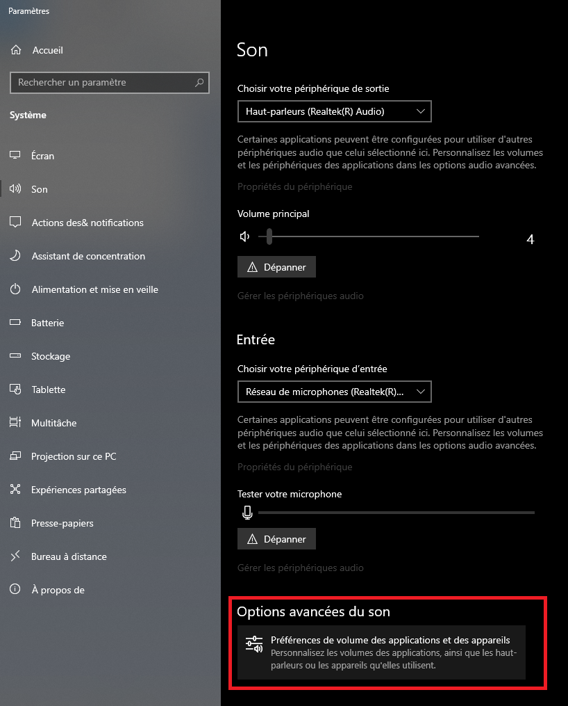
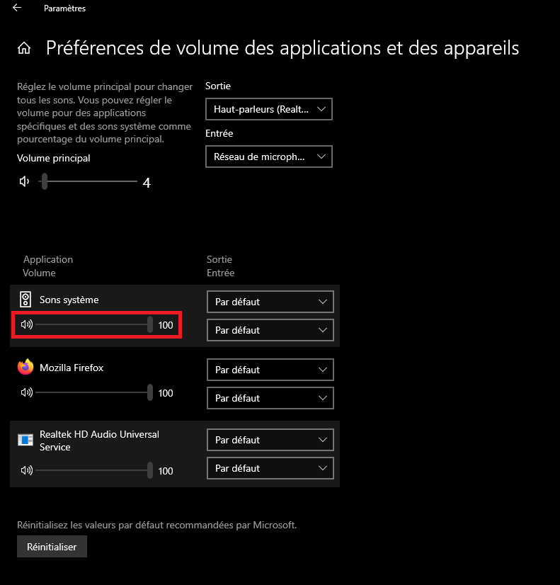

# **Discord : https://discord.gg/zGPGjvngxn**

# **Dofus-multi : Jouer en multi sur les serveurs mono avec le no-anim, bot chasse, bot hdv**

**Pour les utilisateurs de windows, vous pouvez télécharger la dernière version avec ce lien :**

https://github.com/lebossfinal/autowin-ultimate/releases/download/1.0.0/release.zip

**To start in dev mode**

_Start the back_ `cd back && npm install && npm run dev`

_Start the front_ `cd front && npm install && npm run start`

**Vous pouvez jouer à 4 comptes avec un téléphone qui a la 4G et qui est branché en mode routeur, 2 comptes doivent utiliser l'IP par défaut et 2 autres l'IP de votre téléphone**

# Windows Alerts

Pour ceux qui ont des notifications windows en boucle, vous pouvez désactiver le son système en le mettant à 0.

